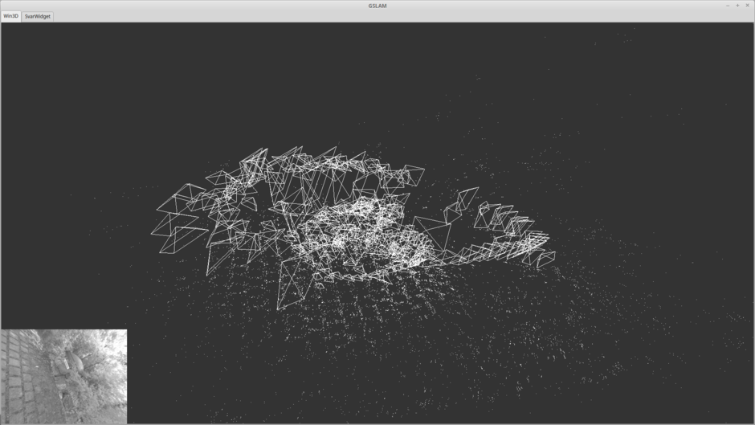

# GSLAM (General Simultaneous Localization and Mapping Framework)

## 1. Introduction

### 1.1. What is GSLAM?
GSLAM is aimed to provide a general open-source SLAM framework with following features :

-> 1. Share the same API while maintain compatibility with different SLAM systems (such as feature based or direct methods).

-> 2. Support Monocular, Stereo, RGB-D or any custom input types (SAR, IMU, GPS and so on).

-> 3. Provide high efficient implementations of SLAM util classes like SO3, SE3, Camera, IMU, GPS, Bundle and so on.

-> 4. Support other features like coorperation SLAM to build a singular map.

### 1.2. What we can do with GSLAM?
1. *For SLAM developers* : Everyone can develop their own SLAM implementation based on GSLAM and publish it as a plugin with open-source or not. 
2. *For SLAM users* : Applications are able to use different SLAM plugins with the same API without recompilation and implementations are loaded at runtime.

### 1.3. Folder structure
* src -- source folder
 - GSLAM   -- Common SLAM APIs 
 - GUtils  -- Utils for GSLAM implementations including Pose optimization, BA frame work
 - ORBSLAM -- Implementation of ORBSLAM (SLAM plugin demo)
 - dso     -- Implementation of dso (SLAM plugin demo)
 - gslam    -- Test system of GSLAM (Apllication demo)

* Thirdparty --- thirdparty libraries
 - PIL		 -- the basic c++ library for configuration, display, plugin loader (enssential, buildin)
 - Eigen 	 -- an opensoure linear algebra library (optional, needed by ORBSLAM plugin)
 - g2o 		 -- a general optimization framework (optional & buildin, needed by ORBSLAM plugin)
 - boost     -- a c++ development library (optional, needed by ORBSLAM)
 - pba 		 -- an opensoure bundle implementation on GPU (optional)

* doc			--- documents

### 1.4. Implemented SLAM plugin
ORBSLAM:
 

DSO:
 

## 2. Compilation

### 2.1. Compile on linux (Tested in Ubuntu 14.04 and 16.04)

#### 2.1.1 Install dependency

Tips: Use ''bash buildAll.sh -d'' to install dependencies. Or you can install the following dependencies by yourself:

**Lapack&Blas** :  sudo apt-get install libblas3 libblas-dev liblapack-dev liblapack3

**Boost** : sudo apt-get install libboost-all-dev libboost-thread* libboost-system* libboost-filesystem*

**OpenCV** : sudo apt-get install libopencv-dev 

**Qt** : sudo apt-get install build-essential g++ libqt4-core libqt4-dev libqt4-gui qt4-doc qt4-designer 

**OpenGL**:sudo apt-get install freeglut3 freeglut3-dev libglew-dev libglew1.10

**QGLViewer** : sudo apt-get install libqglviewer-dev libqglviewer2 

**Chomod for dso**: sudo apt-get install libsuitesparse-dev libeigen3-dev

#### ** WARNING: It it Qt4 instead of Qt5 that should be installed! For Ubuntu 16.06 libqglviewer-qt4 should be linked. **

#### 2.1.2 Compile
bash buildAll.sh -a

###2.2 Compile on windows
Not tested yet.

## 3. Run the demo

3.1. Test modules
./bin/gslam Act=Tests [Cases=[case1,case2,...,caseN]]

3.2. Test slam system
./bin/gslam Act=SLAM VideoReaderTUMMonoDataset.VideoFile="datasetPath/" [SLAM.LibraryPath="SLAMPluginFile"]

3.3. Configuration with Svar
    More parameters can be setted with Svar at file Default.cfg.
    See more details of Svar at [PILBASE](https://github.com/zdzhaoyong/PIL2/blob/master/apps/SvarTest/README.md).

## 4. Contacts

YongZhao: zd5945@126.com

ShuhuiBu: bushuhui@nwpu.edu.cn

